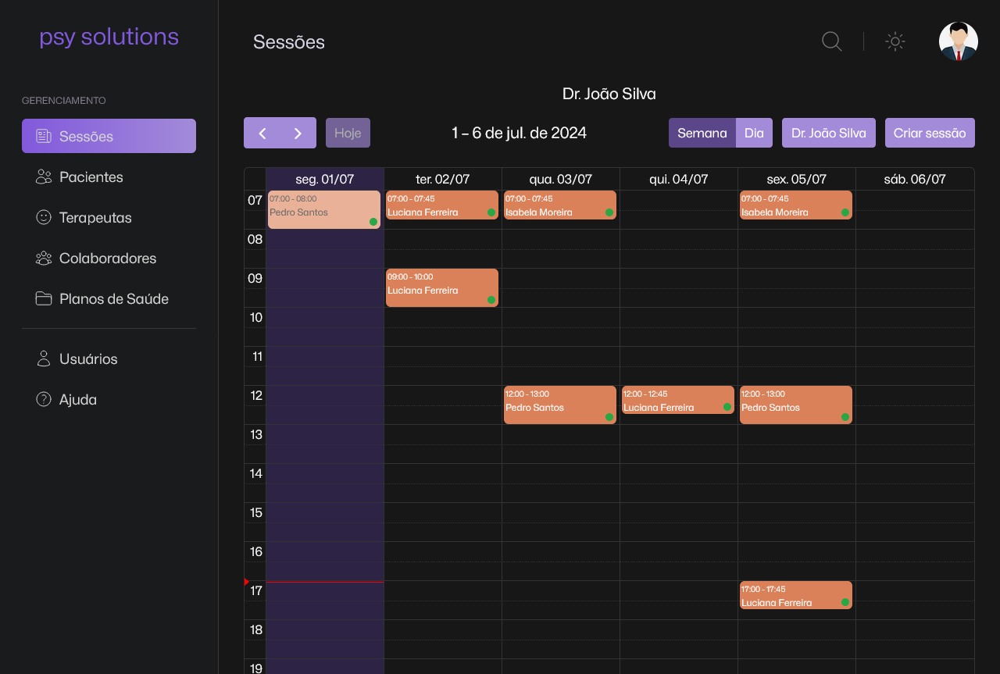

# psyclinic solutions

> Rede social para pets criada com React

### Ajustes e melhorias

Projeto em andamento.

## 💻 Pré-requisitos

Antes de começar, verifique se você atendeu aos seguintes requisitos:

- Você instalou a versão mais recente de `Node.js` e `npm`.

## 🚀 Instalando psyclinic solutions

Para instalar o psyclinic solutions , siga estas etapas:

- Clone esse repositório com `git clone https://github.com/gguilhermelopes/pcs`
- Entre na pasta com `cd pcs`
- Instale as dependências com `npm install`
- É necessário um arquivo de váriaveis de ambiente (.env) como no exemplo abaixo

  `API_URL = 'http://localhost:8080'
LOGIN_CLIENT_ID = 'myclientid'
LOGIN_CLIENT_SECRET='myclientsecret'`

## ☕ Usando psyclinic solutions

Para usar psyclinic solutions, siga estas etapas:

- Certifique-se de que todas as dependências foram instaladas, que o arquivo .env esteja configurado corretamente e que esteja na pasta do projeto. Utilize `npm run dev` e veja em qual porta do seu ambiente local ele foi executado.
